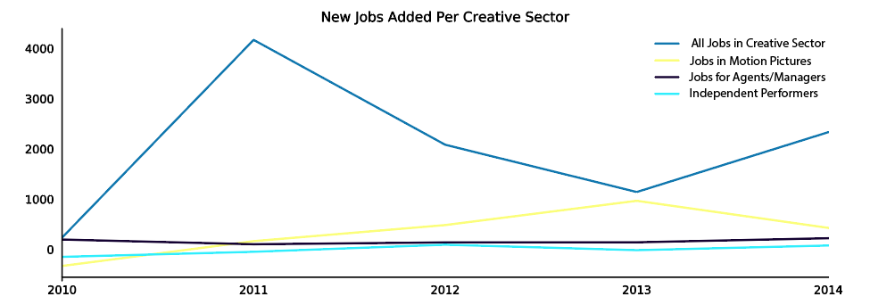

---

title: ATL Film Jobs 
layout: project

---

# Is Y’allywood Sustainable? The Future of Atlanta’s Creative Class 

Since Gov. Nathan Deal signed the 2009 tax credit plan to bring film production to the state, Georgia has quickly become the top location for filming in the nation, outpacing LA and New York. Last year alone films brought in an estimated $9.5 billion impact to the state, mostly through the production of Blockbuster hits and highly-rated television shows. 

The burgeoning film industry is indeed a positive economic driver for the state, but a look at employment statistics within the industry suggest a problematic trend for the future. 

While year-over-year job growth has been positive for the Metro Atlanta area, jobs related to film have not followed this trend. This should raise some flags, particularly knowing how big budget films are stimulating economic development in the area. However, the lack of job growth in the film industry compared to other jobs in the creative sector suggests that big-budget films are bringing in people from out of state in order to finish a production. Without substantial hiring of local talent, the promise of the Deal tax credit may not have the intended outcome for the local economy. 

As a ‘right to work state,’ production companies also take advantage of the state by hiring non-union employees. However, the lack of technically trained people in the state requires production companies to fly in production crews from around the country and forgo hiring Atlanta-based talent for more highly skilled behind-the-scenes work.  

The tax incentives since 2009 have stirred creative talent in the state, particularly bringing a rise in talent managers and educators. This has been a particularly big push for the state's Higher Education institutions, who have recognized the need for job training in the film industry. 

2017 marked the first year where more films were shot in Georgia than any other state (including Hollywood). Earlier in 2017, Nathan Deal and the Georgia General Assembly also passed a tax credit for post-production companies. This would help bring editing and film distribution jobs to Georgia. 

Yet the only film/media related job sector seeing positive job growth is Agents and Managers for talent (which is far outpacing job growth for independent performers).
 

While only 5% of Georgians directly work in Feature Film or Television production,  

(Jobs in film and video production on the rise, according to the Bureau of Labor Statistics - https://www.bls.gov/opub/ted/2017/a-look-at-employment-and-wages-in-the-film-industry.htm) 

However, the Metro Atlanta area is not even in the top ten locations for jobs within film or media production. https://www.bls.gov/oes/current/oes270000.htm 