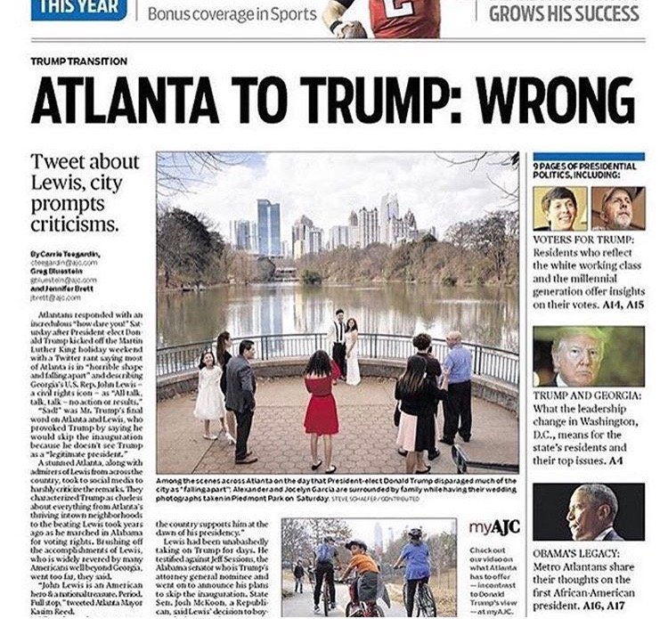
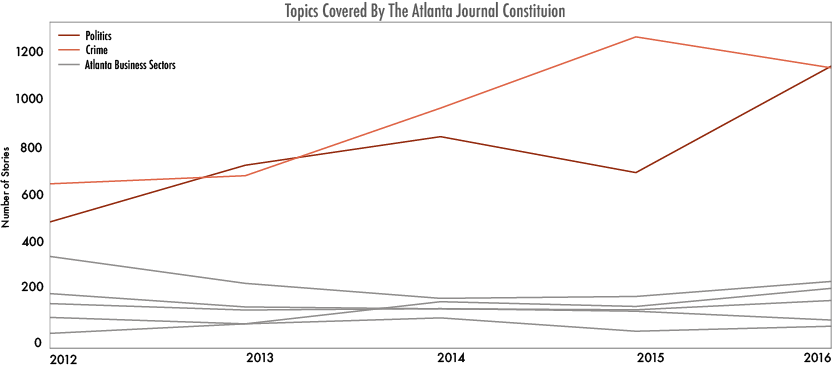
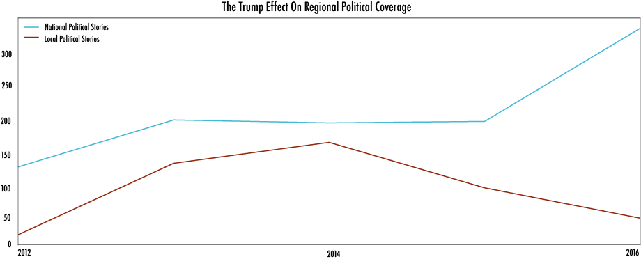

---

title: The Trump Effect On Local News
layout: project

---

## The Trump Effect On Local News

##### Headlines in regional papers have become decisively more political. Trending topics suggest that the national rhetoric in the post-2016 election is changing the shape of local news. 

2016 was the 'Year of Trump' for national news. Cable TV, national newspapers, late night talk shows and individual's mobile newsfeeds followed the Presidential Election closer than ever, causing a shift in how journalists and the public at large interacted with politics. But it also may have disporportionately shifted the business of local news.

Between the 2012 and 2016 elections, the Atlanta Journal Constitution's coverage of American politics (both regional and national) rose 120%. But coverage of other major topics, particularly Atlanta's budding technology, film and business sectors, remained relatively unchanged over the four year period. Even when analyzing Atlanta-centric headlines in the AJC, 35% of stories that ran in the Atlanta Journal Constitution mentioned Trump explicitly. 

### Political Reporting In The Age Of Trump 

AJC's decision to increase political coverage is most likely a result of multiple factors. First, of course, the Trump/Clinton 2016 race captured the attention of the American public more than the Obama/Romney 2012 race, making it a critical part of local life and dialogue. It is also important to note that 2016 saw several high-profile Georgians enter the national poltical sphere, namly Tom Price and Sonny Perdue as early additions to Trump's cabinet, making political coverage a more central part of Georgia journalism.

However, a unique trend emerges when breaking down the number of AJC headlines focusing on local and national politics during the 2016 year. 

 

2016 Front Page Stories about national politics far outpaced stories about regional politics. This is despite the fact that Georgia held local elections for US Senate and House seat, along with several hotly contested state legislative positions. 

Covering national politcs is important for regional papers, particularly when reports are able to contextualize issues for people closer to home. But as national news fills more space in local papers, TV stations and several digital news feeds, it is important to contextualize what local stories might be overlooked.