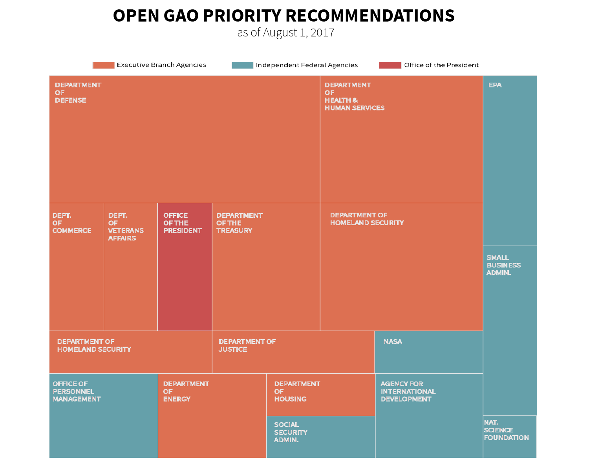
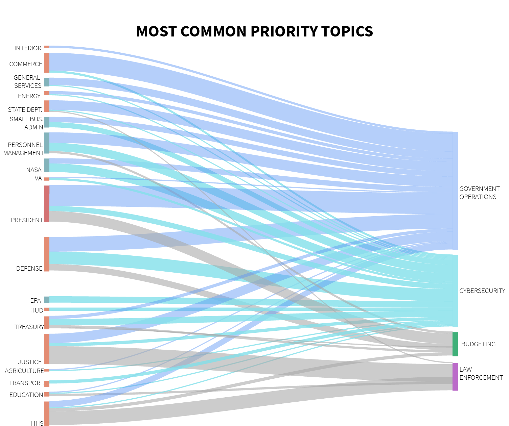

---

title: Quantifying Government Accountability
layout: project

---

## Quantifying Government Accountability

##### Maija-Liisa Ehlinger

Want to know the daily climate of Washington?
Check Twitter.

Want to know the actual state of Washington?
Check the GAO database. 

Created in the aftermath of World War I, GAO (Government Accountability Office) serves as the auditing arm of the Federal Government and investigates any agency or department that receives public funds. As Congress' "official watchdog," GAO provides reports where audits turn up cases of "fraud, waste or mismanagement" within an agency. 

As a non-partisan agency within the US Federal Government, GAO provides a crucial service in American democratic society. But understanding where GAO focuces most of its audit and reporting time also gives a unique perspective on how the US government is functioning at any time. Open priority recommendations showcase what departments might be falling behind as they prepare for the future. 

Members of Congress request for GAO to audit or review of any agency or department within the Federal Government. Currently all open and tagged priority recommendations are within Executive Branch Agencies or Independent Agencies. None are within the Judicial or Legislative Branch.

More than 75% of incompleted GAO reports are within the Executive Branch, mostly falling within Departments that report directly to the President of the United States.

Since its founding GAO has prepared over 54,000 reports across the Federal Government. 32,000 of these have been within Executive Branch agencies, 10,000 within Independent agencies and 2,250 within Legislative agencies and 184 within Judicial branch agencies. 

GAO's database is constantly updated as agencies make progress on potential areas of fraud or mismanagement. An interesting trend emerges when looking at what topics are most often tagged as Priority Items by the GAO. While there are over 1300 priority topics tagged within the database, most reports fall within the categories of Government Operations and Cybersecurity.

 

GAO has placed a priority on cybersecurity efforts and overall government operations for the last decade. While there are some priority recommendations have been open for over a decade (the oldest non-addressed item dating back to 2004), those currently open under the label of cybersecurity showcase how no part of the Federal Government is fully secure or ready for the 21st century.

