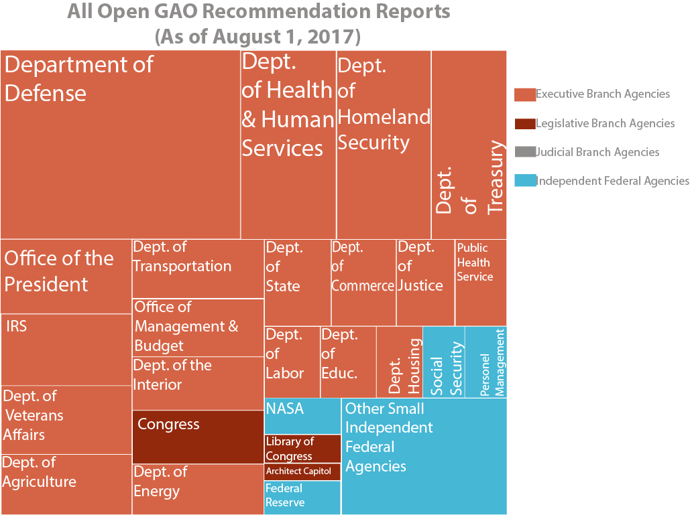
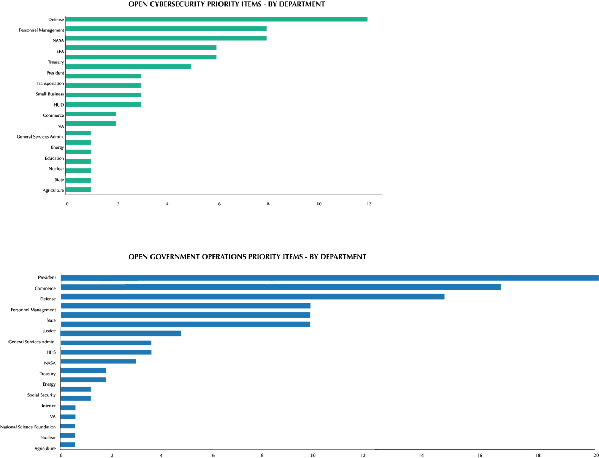

---

title: Quantifying Government Accountability
layout: project

---

## Quantifying Government Accountability

##### Maija-Liisa Ehlinger

Want to know the daily climate of Washington?
Check Twitter.

Want to know the actual state of Washington?
Check the GAO database. 

Created in the aftermath of World War I, GAO (Government Accountability Office) serves as the auditing arm of the Federal Government and investigates any agency or department that receives public funds. As Congress' "official watchdog," GAO provides reports where audits turn up cases of "fraud, waste or mismanagement" within an agency. 

As a non-partisan agency within the US Federal Government, GAO provides a crucial service in a democratic society. But understanding where GAO focuces most of its audit and reporting time also gives a unique perspective on how the US government is functioning at any time. In fact the open recommendations (those that have yet to be completed) showcase what departments might be falling behind as they prepare for the future. 

More than 75% of incompleted GAO reports are within the Executive Branch, mostly falling within Departments that report directly to the President of the United States. 

 

 

