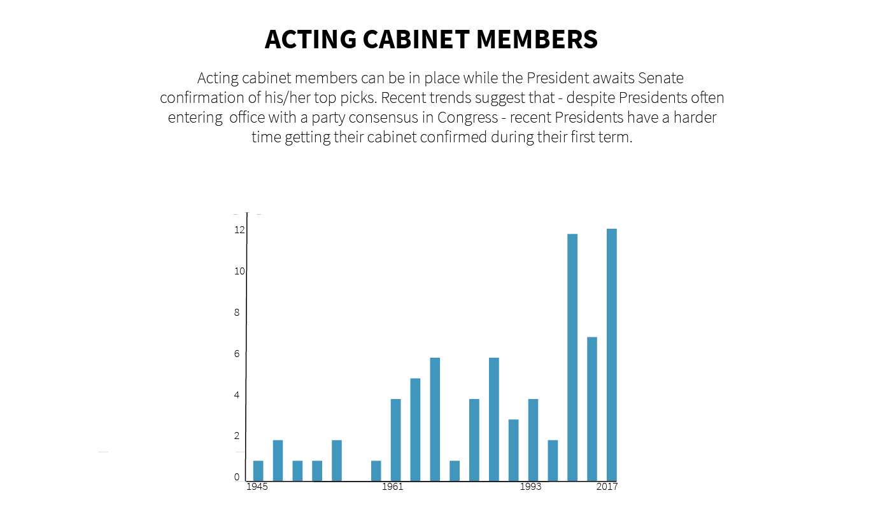
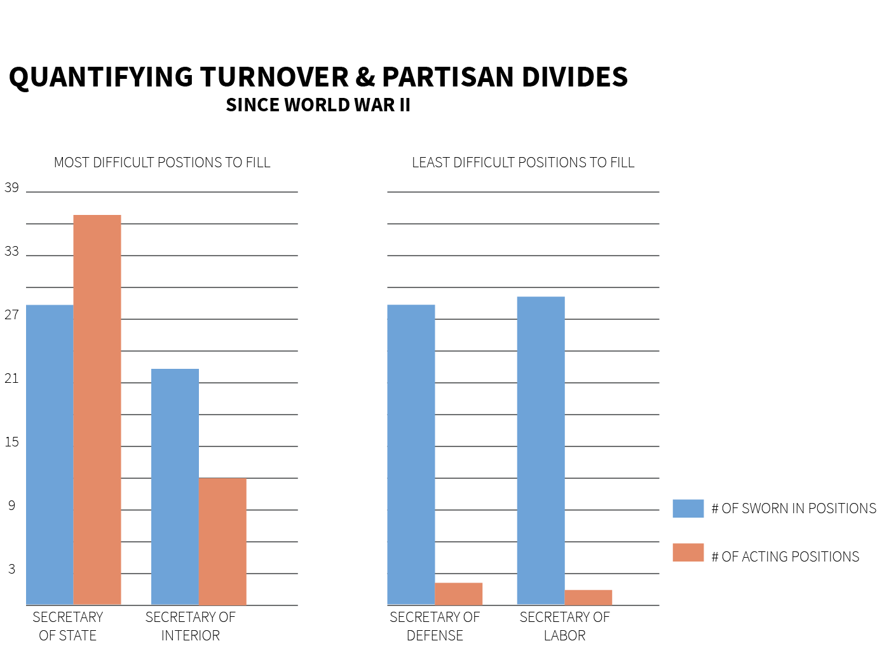
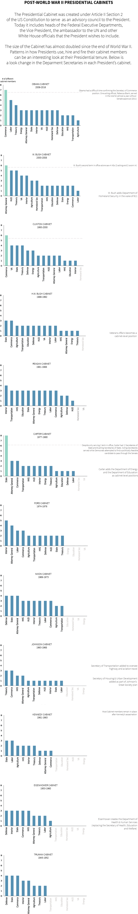

---

title: Cleaning Out A Presidential Cabinet
layout: project

---

## CLEANING OUT A PRESIDENTIAL CABINET

##### Maija-Liisa Ehlinger

Preibus is out, Kelly is moving, and Sessions is taking a step back from all things Russia. 

In a year of unprecidented volatility in Washington, Trump's Presidential Cabinet has been in the spotlight more than any other cabinet in recent political history. Because throughout his first 200 days President Trump has been playing a real-time version of musical chairs with his White House staff and closest advisors - and all eyes seem to be looking for who will be out of the circle next. 

But turnover in the Presidential Cabinet has been a growing political trend since World War II and can be seen as a flashpoint for partisanship and political spectacle. 

The hirings and firings of key cabinet officials can be seen as a metric for political stability in Washington. It is interesting to note that the number of acting cabinet memembers have risen sharply in the past decade. Acting members are instated by the incoming Administration when they are unsure about how long the Senate will take to confirm their top picks. 

Under the US Constitution an acting Cabinet member can stay in the position for up to 300 days without Senate confirmation. The steep rise in acting cabinet members shows two interesting trends: one, recent Presidents have had a harder time getting their nominations into the Cabinet at the start of their tenure and two, they are increasingly having to instate acting members as turnover within positions increases. 

According to the [Washington Post](https://www.washingtonpost.com/graphics/politics/how-long-confirmations-will-take/), Trump had to wait an average of 25 days for the Senate to approve his top cabinet picks (a significantly long time given the Republican control in Congress).

(next step: I need to find a way to make a chart that more completely shows turnover from a datetime perspective) 

