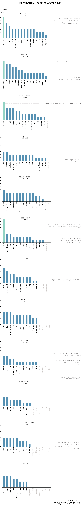

---

title: Cleaning Out A Presidential Cabinet
layout: project

---

## CLEANING OUT A PRESIDENTIAL CABINET

##### Maija-Liisa Ehlinger

Preibus is out, Kelly is moving, and Sessions is taking a step back from all things Russia. 

In a year of unprecidented volatility in Washington, Trump's Presidential Cabinet has been in the spotlight more than any other cabinet in recent political history. Because throughout his first 200 days President Trump has been playing a real-time version of musical chairs with his White House staff and closest advisors - and all eyes seem to be looking for who will be out of the circle next. 

But turnover in the Presidential Cabinet has been a growing political trend since World War II and can be seen as a metric for political stability in Washington. The sharp increase in acting cabinet members also suggests that Federal Agency positions are becoming more politicized. Even when recent presidents have had party concensus they have an increasingly difficult time adding or maintaining key cabinet positions.

According to the [Washington Post](https://www.washingtonpost.com/graphics/politics/how-long-confirmations-will-take/), Trump had to wait an average of 25 days for the Senate to approve his top cabinet picks (a significantly long time given the Republican control in Congress). This delayed confirmation process required acting members to remain in key positions for longer than average.

And just six months into the job, Trump is already dealing with an acting seat as he has moved John Kelly out of the Secretary of Homeland Security position to become the White House Chief of Staff.

Under the US Constitution an acting Cabinet member can stay in the position for up to 300 days without Senate confirmation. The steep rise in acting cabinet members shows two interesting trends: one, recent Presidents have a harder time getting their nominations into the Cabinet at the start of their tenure and two, they are instating more acting members as turnover within positions increases.

It is interesting to note that Secretaries of State and the Interior have the most turnover and acting members within a Presidential administration, suggesting these are the most politicized Executive Branch cabinet positions.

On the other hand, Secretaries of Defense and Labor remain in cabinet-positions for longer and have had significantly fewer acting members.

******

The Presidential Cabinet was created under Article II Section 2 
of the US Constitution to serve  as an advisory council to the President. 
Today it includes heads of the Federal Executive Departments, 
the Vice President, the ambassador to the UN and other 
White House officials that the President wishes to include.

The size of the Cabinet has almost doubled since the end of World War II to include seven more Executive Branch agencies. These agencies, which advise the President on everything from educational standards to  
Patterns in how Presidents use, hire and fire their cabinet members 
can be an interesting look at their Presidential tenure.

Each Presidential cabinet provides a unique look into the state of Washington at the time. Not only does it showcase any tensions between the Executive Branch and the Senate, it also shows unique trends into what part of the government was most contested at the time. Below is
a look change in the Deparment Secretaries in each President’s cabinet.  

