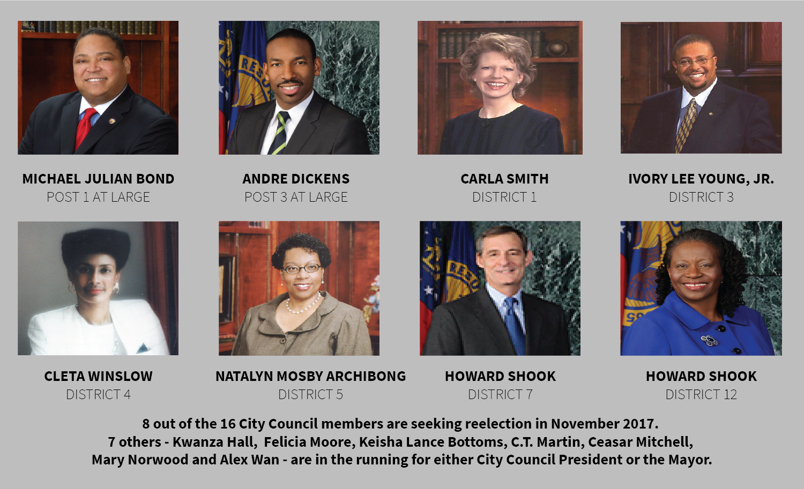

---

title: What Qualified Candidates Tell Us About The Future Of Atlanta

layout: project

---

# HOW LIKELY IS A CITY HALL SHAKE UP? 

###### MAIJA-LIISA EHLINGER
###### August 30, 2017

<h6>Atlanta is gearing up for hotly contested City Council, Mayoral and Board of Education elections this November. But with 15 out of the 16 current City Council representatives seeking re-election or new seats in the city legislator, early signs suggest a full 'shake up' is unlikely.</h6>

<i>This cycle's mayoral candidates overwhelmingly live in the city's south and southeastern parts of the city. 2 candidates - Keisha Lance Bottoms and Cathy Woolard - live just outside Atlanta city limits.</i>

Thirteen candidates are in the running to take over Mayor Kasim Reed's seat in the November 2017 election. This pack includes several familiar names, as current City Councilmembers Kwanza Hall, Mary Norwood, Keisha Lance Bottoms and Ceasar Mitchell are all looking to take over the top seat in Atlanta politics.

This large crowd of candidates is a clear indication of frustration with Atlanta politics in general, as Reed and several City Council members have battled corruption charges over the past four years. But down ballot races suggest that a strong 'shake up' isn't all that likely. 
 

<h3>Incumbents In The Race</h3>

 

15 out of the 16 people currently serving as City Council members are seeking re-election or another seat within the legislator, and six out of the nine current members of the Board of Education are also hoping to maintain their seats. 

Such a large group of familiar faces may seem like a sign that City Hall will remain relatively the same over the next 4 years. 

This is particularly noticable in the three at-large City Council posts. Traditionally, these positions can quickly change the pulse and direction of the council both demographically and geographically. But this year's group of candidates is fairly small, as three men are running to replace Mary Norwood's vacant seat and only one man - Courtney D. English - is looking to upset an incumbent at-large seat.

<h3>Races To Watch</h3>

While most races include familiar names from the current legislative body, only 3 seats in City Council and the Board of Education are uncontested. These contested races will be key for the overall direction of City Council. 

<h6>City Council District Four</h6>

On the City Council side, one crucial district to watch is District 4, where nine new candidates are running to oust Cleta Winslow from office. Winslow, who has served on City Council since 1993, has been found [misusing taxpayer money](http://investigations.blog.ajc.com/2016/02/24/fulton-prosecutor-not-taking-on-cleta-winslow-case/) for previous campaigns, along with a [DUI](http://www.ajc.com/news/crime--law/atlanta-councilwoman-given-probation-700-fine-for-dui-charge/77bxvfFymqrFuFNQ5OERJO/) in 2013.

<i>Code and analysis can be found on my [GitHub page](https://github.com/maijaliisa/studio-projects/tree/master/code/city_council).</i>
