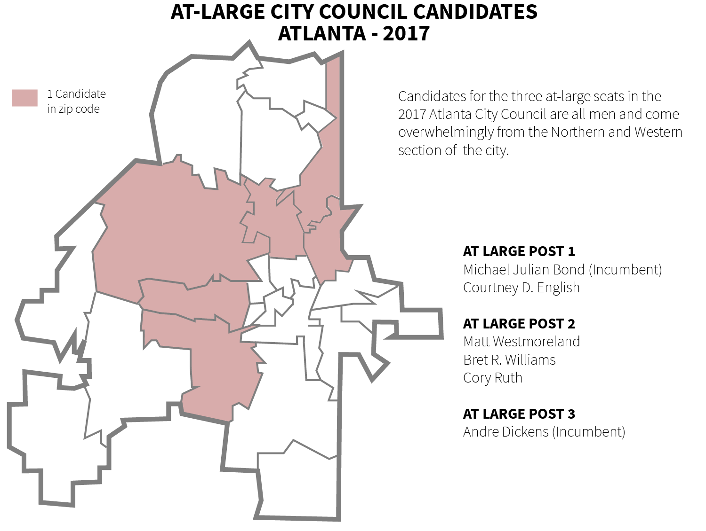

---

title: ATL City Council Race By The Numbers
layout: project

---

# City Hall Shake Up: What Qualified Candidates Tell Us About The Future Of Atlanta

###### MAIJA-LIISA EHLINGER
###### August 30, 2017

<h6>Atlanta is gearing up for hotly contested City Council, Mayoral and Board of Education elections this November. While 15 out of the 16 current City Council representatives are seeking re-election or new seats in the city legislator, new candidates entering the race are hoping to disrupt the status quo in City Hall.</h6>

<i>This cycle's mayoral candidates overwhelmingly live in the city's south and southeastern parts of the city. 2 candidates - Keisha Lance Bottoms and Cathy Woolard - live just outside Atlanta city limits.</i>

Thirteen candidates are in the running to take over Mayor Kasim Reed's seat in the November 2017 election. This pack includes several familiar names, as current City Councilmembers Kwanza Hall, Mary Norwood, Keisha Lance Bottoms and Ceasar Mitchell are all looking to take over the top seat in Atlanta politics.

This large crowd of candidates is a clear indication of frustration with City Hall, as candidates are making strong claims early on to clean up the city in the wake of multiple corruption charges across all branches of government. 
 

<h3>Potential Shake Ups</h3>

 

15 out of the 16 people currently serving as City Council members are seeeking re-election or another seat within the legislator, and six out of the nine current members of the Board of Education are also hoping to maintain their seats. But only 3 seats across City Council and the Board of Education are uncontested, suggesting that the City is ready for a shake up in local politics.

<h3>Races To Watch</h3>

<h6>City Council District Four</h6>

On the City Council side, one crucial district to watch is District 4, where 9 new candidates are running to oust Cleta Winslow from office. Winslow, who has served on City Council since 1993, has been found [misusing taxpayer money](http://investigations.blog.ajc.com/2016/02/24/fulton-prosecutor-not-taking-on-cleta-winslow-case/) for previous campaigns, along with a [DUI](http://www.ajc.com/news/crime--law/atlanta-councilwoman-given-probation-700-fine-for-dui-charge/77bxvfFymqrFuFNQ5OERJO/) in 2013.

<h6>City Council At Large Posts</h6>

The Atlanta City Council charter (adopted in 1996) restructured the council to include 3 at-large posts. These positions can quickly change the pulse and direction of City Council based on where the at-large members live. But this year's group of candidates is fairly small, as a group of three men are running to replace Mary Norwood's vacant seat and only one man - Courtney D. English - is looking to upset an incumbent at-large seat. 

<i>Code and analysis can be found on my [GitHub page](https://github.com/maijaliisa/studio-projects/tree/master/code/city_council).</i>
