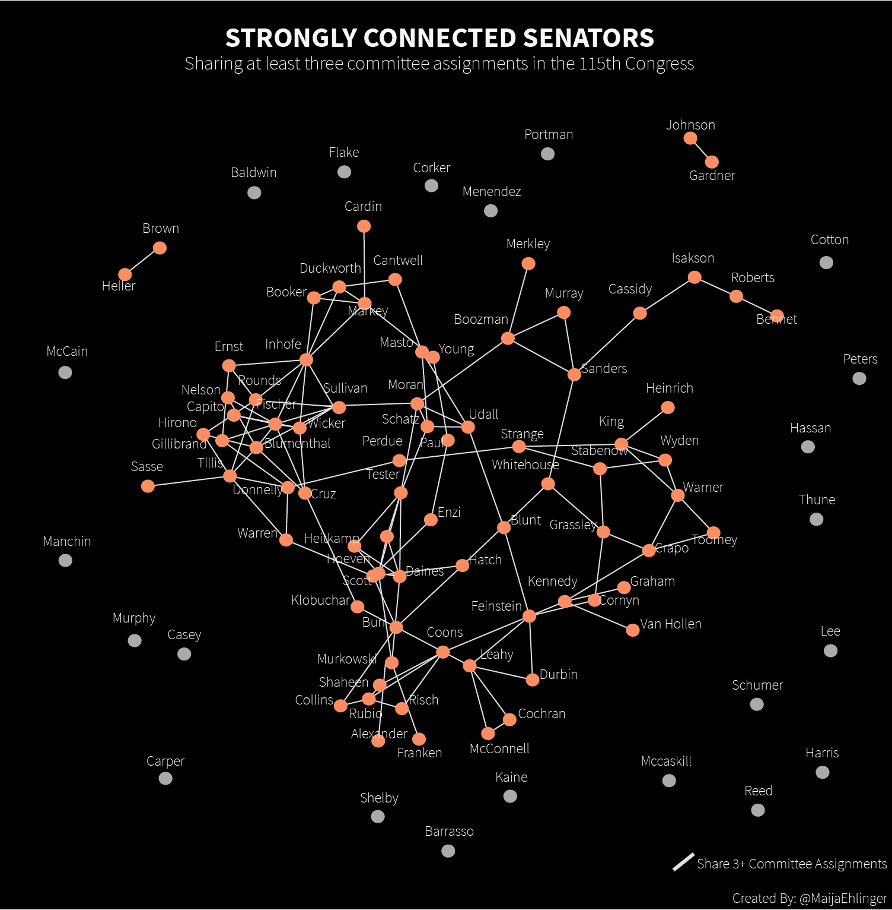
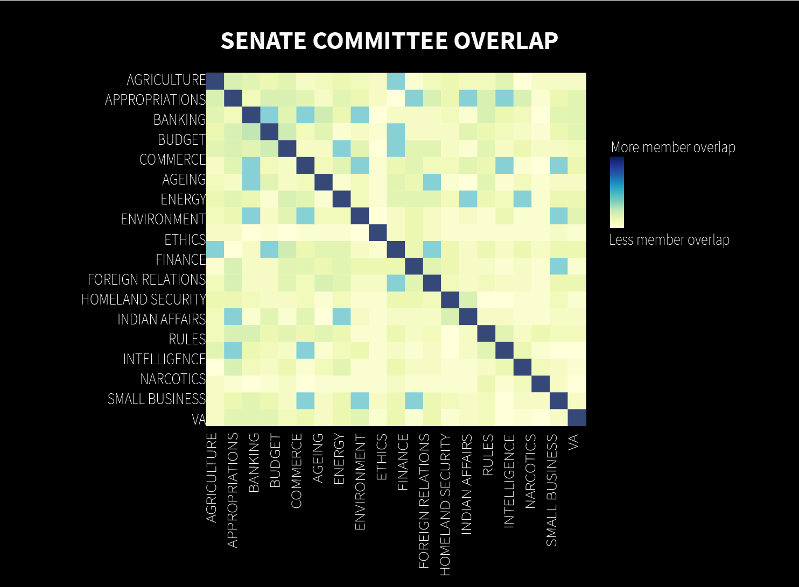
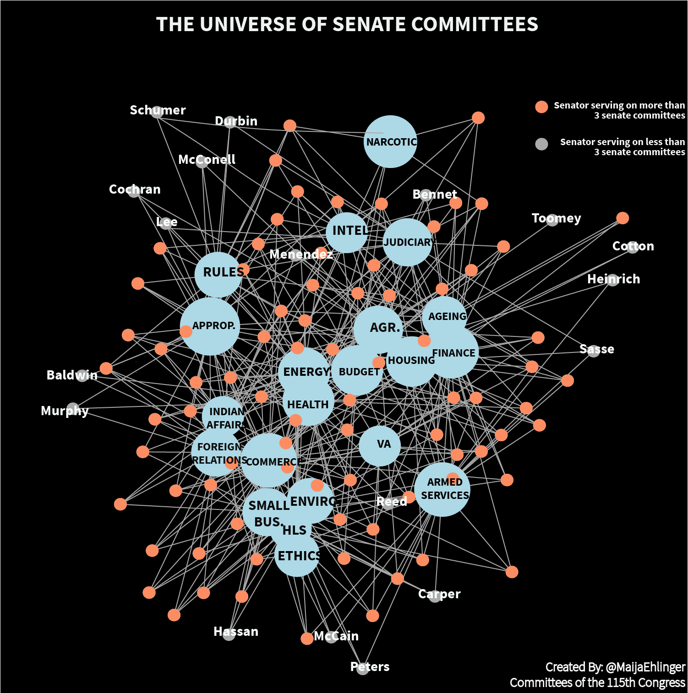

---

title: Visualizing Senate Universe
layout: project

---

## HOW SENATORS INTERACT WITHIN THE 115TH CONGRESS

##### Maija-Liisa Ehlinger

<h6>The 115th Congress has already been marked by intense division over several key bills. But exploring the network created by Senate committee assignments can show interesting partisan divides and bipartisan interactions.</h6>

