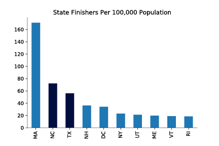

---

title: Traveling Runners
layout: project

---

# MA, NC, TX Most Represented At 2017 Boston Marathon

The sheer spectacle of a marathon continues to capture athletes and non-athletes alike. The average runner trains for several months in order to run for up to five hours straight. 0.8 per 100,000 marathon participants will experience sudden cardiac arrest during the 26.2 mile test. And yet, over half a million Americans hit the pavement last year to compete in one of the countries' races. And while running is a hobby, it is also a unique sector of the travel industry. 

Within the biggest American-held marathons in 2016/2017, 42% traveled out of state or out of the country to compete. Every state in the Union was represented, but North Carolina, Texas and New Hampshire sent the most runners per capita to the most iconic of races - Boston.  

## Boston Marathon Finishers By The Numbers 

According ot the Boston Athletic Association (BAA), which organizes the 120 year race, qualifying for the Boston Marathon is based on time/age. However, qualifying times only give you "the opportunity to submit for registration." Actual admittance depends on the number of qualifying time per year.

