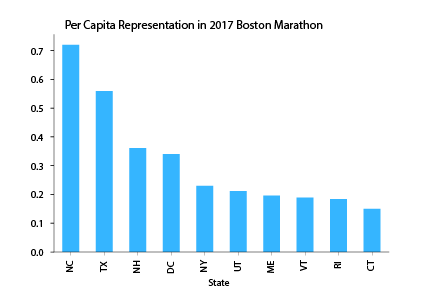
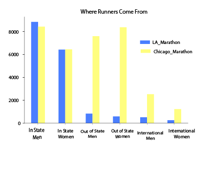
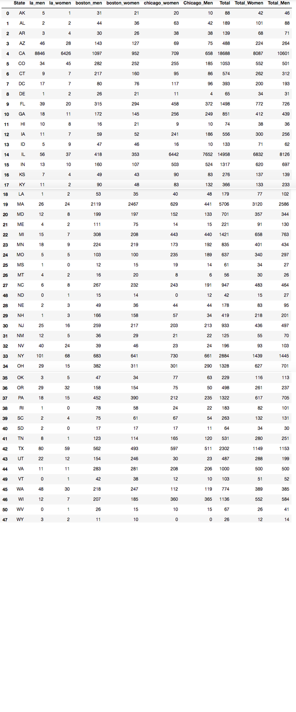

---

title: Traveling Runners
layout: project

---

# Traveling Runners: Marathons Entice Runners To Head Out Of State

The sheer spectacle of a marathon continues to capture athletes and non-athletes alike. The average runner trains for several months in order to run for up to five hours straight. 0.8 per 100,000 marathon participants will experience sudden cardiac arrest during the 26.2 mile test. And yet, over half a million Americans hit the pavement last year to compete in one of the countries' races. And while running is a hobby, it is also a unique sector of the travel industry. 

Within the biggest American-held marathons in 2016/2017, 42% traveled out of state or out of the country to compete. Every state in the Union was represented, but North Carolina, Texas and New Hampshire sent the most runners per capita to the most iconic of races - Boston.  

## Boston Marathon Finishers By The Numbers 

Qualifying for the Boston Marathon is based on time/age rates, making it one of the most competitive races for which you can gain entry. But it is not the only race in the US that will get active runners to travel across the country. Of other top US marathons, Chicago attracts the most out-of-town runners (nearly double those who head to the similarly-sized LA Marathon).

## LA and Chicago Marathon Finishers By Category 

## See How Your State Ranked In Boston, LA & Chicago Marathongs

