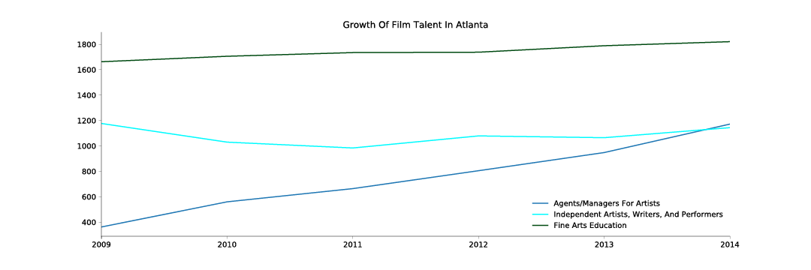

---

title: ATL Film Jobs 
layout: project

---

# Film Tax Incentives Drive Job Growth 

While only 5% of Georgians directly work in Feature Film or Television production, the industry has a $9.5 billion economic impact on the state. Since Governor Nathan Deal's tax incentive plan in 2009, which gave a 20% credit for production companies opting to shoot in the state, film/TV has been one of the most steadily-increasing job creators in the post-recession economy. 

The tax incentives since 2009 have stirred creative talent in the state, particularly bringing a rise in talent managers and educators. This has been a particularly big push for the state's Higher Education institutions, who have recognized the need for job training in the film industry. 

2017 marked the first year where more films were shot in Georgia than any other state (including Hollywood). Earlier in 2017, Nathan Deal and the Georgia General Assembly also passed a tax credit for post-production companies. This would help bring editing and film distribution jobs to Georgia. 