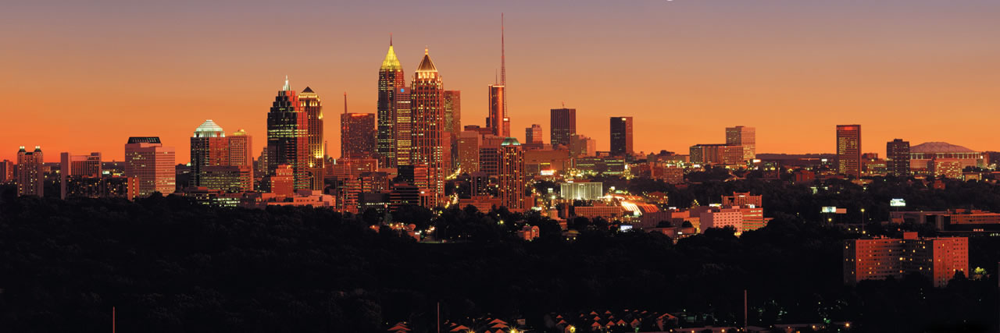
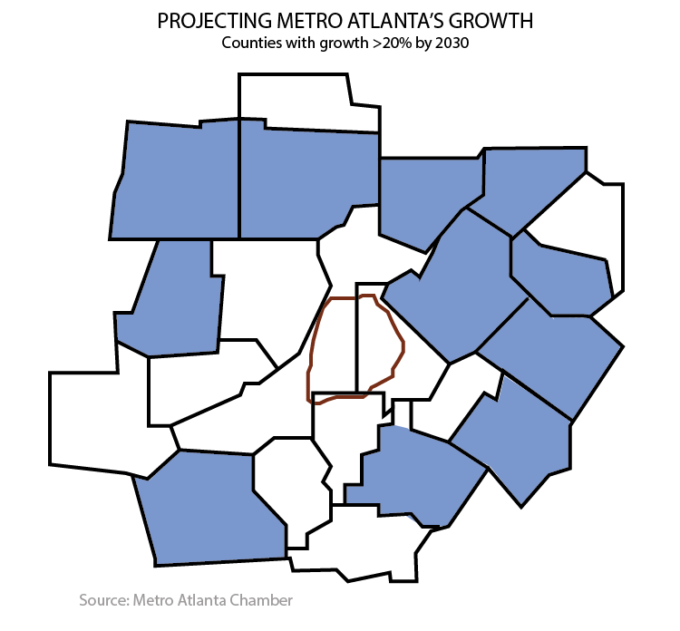
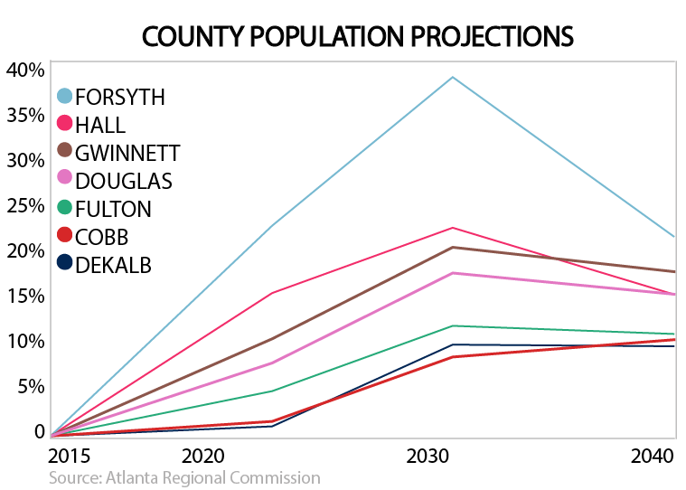

---

title: Expanding the definition of Atlanta  

layout: project

---

# EXPANDING THE DEFINITION OF ATLANTA

###### MAIJA-LIISA EHLINGER
###### October 6, 2017

<h6>Atlanta's development is reshaping the skyline and the economic prospects of Downtown, Midtown and several other hot spots around the perimeter. But The city's future will rely mostly on the population increases in outlying metro counties, creating more uncertainty about whether we can continue to define ATL by 285.</h6>
 

According to the latest estimates by the [Atlanta Regional Commission](http://atlantaregional.org/population-employment-forecasts/), every county in the area will see at least a 9% population increase by 2030, bringing the total population for metro Atlanta to over 8 million. But major population growth (greater than 20%) over the next twelve years will only be in outyling counties like Forsyth, Hall and Douglas. 

[Job growth](http://atlantaregional.org/population-employment-forecasts/), however, continues to center around economic hubs in North Fulton, East Cobb and West DeKalb.

These two diverging trends - jobs in one spot and people in another - will serve only to increase two of the biggest problems Atlanta already faces: traffic and socioeconomic inequality. These in turn will be the defining principles for Atlanta's future growth.

 

Metro Atlanta added [90,650 people in 2016](http://www.ajc.com/news/local-govt--politics/census-metro-atlanta-population-approaches-million/1pxSPBRYI6L26zn4jgVBrN/), making it the fourth-fastest growing area in the country.

<h2>How we define Atlanta</h2>

The process of redefining the Metro area as an world-class business city has blurred the lines of what actually constitutes 'Atlanta'. It has also ramped up the efforts of smaller suburban cities, like Alpharetta, [Grayson and Woodstock](http://www.ajc.com/news/local/these-are-georgia-fastest-growing-cities/3H6kwbI1mrVGFbb4ppR6II/) to grow business centers and hubs to compete with downtown Atlanta. 

As Atlanta expands ever outwards, we must realize that the outlying cities are as much part of the city's success as any business deal within the perimeter. As more Atlantans live outside the city proper limits, we need to find a way to connect all parts of the Metro area that are attracting more and more people. 