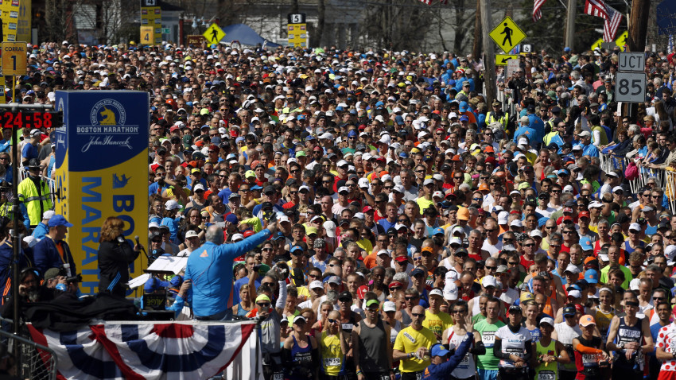
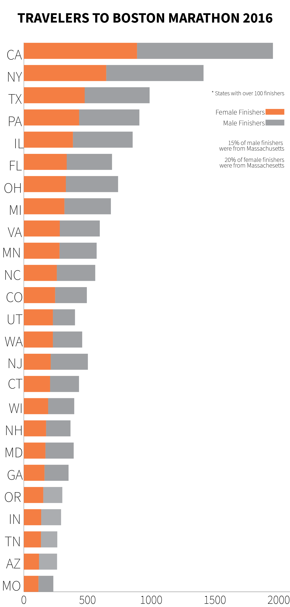
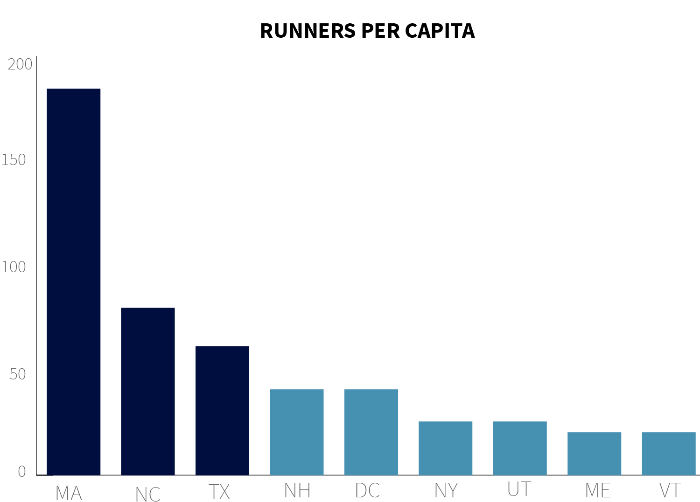

---

title: Traveling to Boston Becomes Bigger Trend
layout: project

---

# MA, NC, TX Most Represented At 2017 Boston Marathon

###### MAIJA-LIISA EHLINGER

For runners and non-runners alike, The Boston Marathon carries historic and nearly unquantifable weight. For 121 years runners have crossed through Hopkinton and conquered Hearbreak Hill in a 26.2 mile test of shear endurance. A record 26,400 people finished the Boston course in 2017, running a collective 691,680 miles around the city. Every state in the Union was represented, but some states sent a much higher percentage of runners to the start line this year. 

In this most elite and iconic race of the year, 42% traveled out of state or out of the country to compete. 

While California and New York far outpaced other states in terms of number of qualified runners, it was actually North Carolina and Texas that sent the most runners per capita to Boston this year. 

According ot the Boston Athletic Association (BAA), qualifying for the Boston Marathon is based on both time and age. However, these qualifying times only give runners "the opportunity to submit for registration." Actual admittance depends on the number of qualifying time per year.

Massachusetts of course had the most runners for its population, but that doesn't necessarily mean that the state holds the most amount of qualifying runners. Each year the BAA reserves several sports for those who can raise over $5,000 for a charity within the city.

